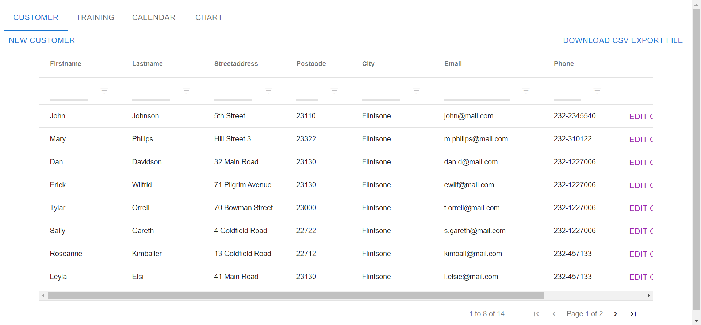
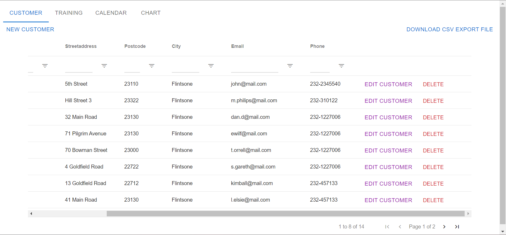
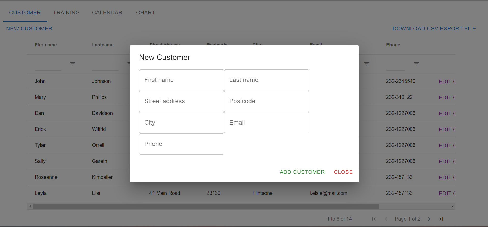
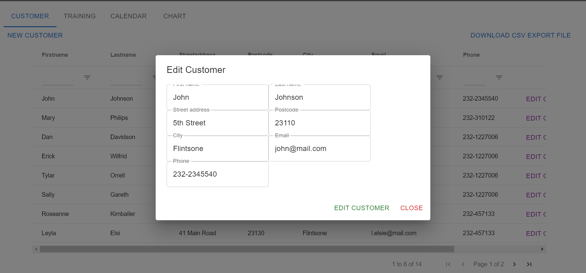
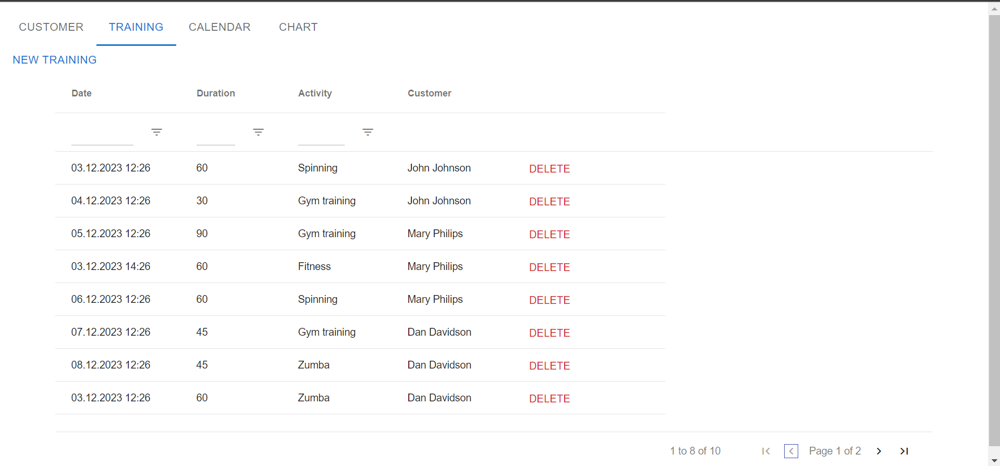
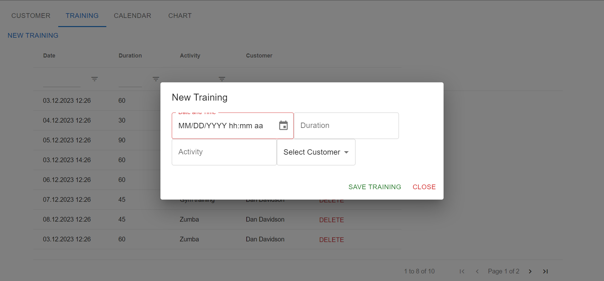
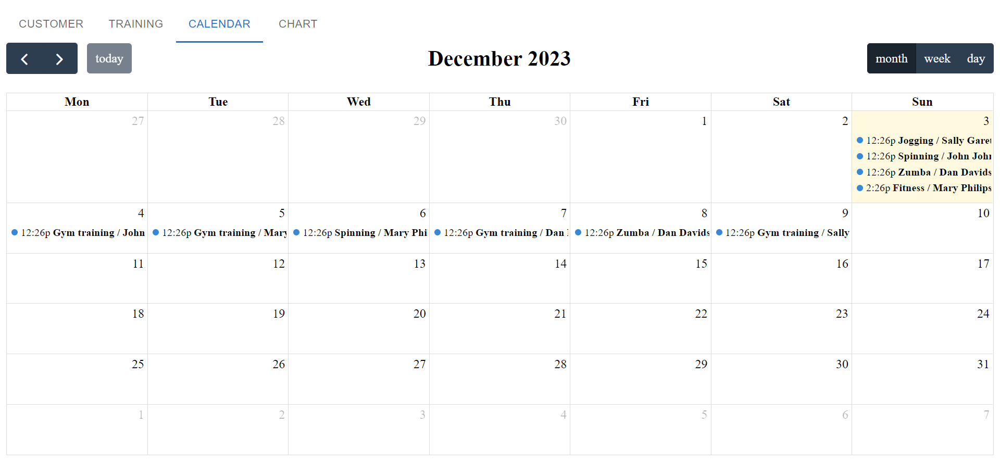
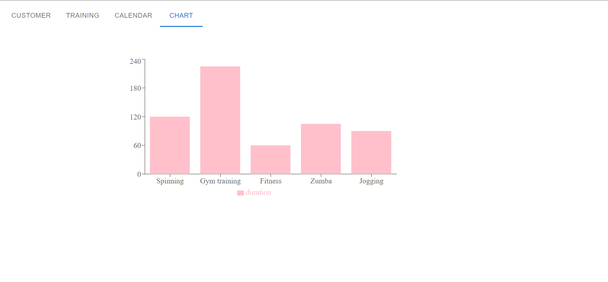

# Training App
Training App is a personal training application, where the user can 
- see, add, edit and delete customers
- see, add and delete trainings
- see all trainings in a calendar
- see a chart of the durations of all trainings
- load customer data as a csv file

This project is done as an end task of Frontend developing course.

## Technologies used
- JavaScript
- React
- Vite.js

## Screenshots
Customer list

Form for adding a new customer

Editing an existing customer

Training list

Form for adding a new training

Calendar view

Chart view
